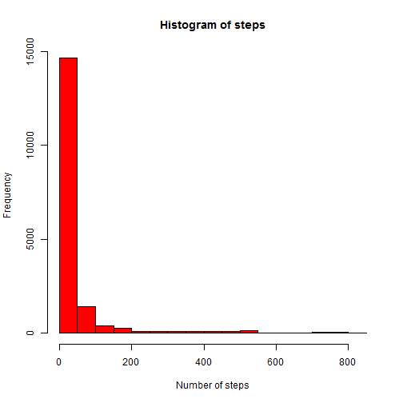

# Reproducible Research: Peer Assessment 1
## Loading and preprocessing the data


```r
unzip("activity.zip")
input <- read.csv("activity.csv")
```

## What is mean total number of steps taken per day?


```r
meansteps <- mean(input$steps, na.rm = TRUE)
mediansteps <- median(input$steps, na.rm = TRUE)
hist(input$steps, 
     col="red",
     main="Histogram of steps", 
     xlab="Number of steps", 
     ylab="Frequency")
```

 
  
The mean steps per day is 37.3825996.  
The median number of steps per day is 0. 

## What is the average daily activity pattern?


```r
library(plyr)

inputIntervalMeans <- ddply(input,"interval",summarize, steps=mean(steps,na.rm=TRUE))
plot(inputIntervalMeans$interval,
     inputIntervalMeans$steps, 
     type="l", lwd=2, col="red", 
     main="Steps by time of the day", 
     xlab="Time of the day",
     ylab="Number of steps")
```

 

```r
maxSteps <- inputIntervalMeans$interval[which.max(inputIntervalMeans$steps)]
```
  The most active interval during the day is 835. 
  
  
## Imputing missing values


```r
missingValues <- sum(is.na(input$steps))
```
  There are total of 2304 values missing from the dataset. 

  Missing values will be filled with the average value for that time of the day.

```r
inputAugmented <- input

rows <- nrow(inputAugmented)
for (i in 1:rows)
    if (is.na(inputAugmented[i,1])){
        inputAugmented[i,1] <- 
        inputIntervalMeans[which(inputIntervalMeans$interval 
                                 == inputAugmented[i,3]),2]
    }
         
meanstepsAug <- mean(inputAugmented$steps)
medianstepsAug <- median(inputAugmented$steps)
hist(inputAugmented$steps, 
     col="red",
     main="Histogram of steps", 
     xlab="Number of steps", 
     ylab="Frequency")
```

 
  
The mean steps per day is 37.3825996.  
The median number of steps per day is 0.

Because missing values were filled with average values from available data,  
mean and median were unchanged.

## Are there differences in activity patterns between weekdays and weekends?


```r
library(lubridate)
```

```
## 
## Attaching package: 'lubridate'
## 
## The following object is masked from 'package:plyr':
## 
##     here
```

```r
library(plyr)

inputWE <- mutate(inputAugmented, weekend = wday(input$date)%/%6)
inputWEIntervalMeans <- ddply(inputWE,c("interval","weekend"),
                              summarize, steps=mean(steps))

weekend <- inputWEIntervalMeans[which(inputWEIntervalMeans$weekend==1),]
weekday <- inputWEIntervalMeans[which(inputWEIntervalMeans$weekend==0),]

par(mfrow = c(2,1))
plot(weekend$interval,
     weekend$steps, 
     type="l", lwd=2, col="red", 
     main="Weekend",
     xlab="Time of the day",
     ylab="Number of steps")
plot(weekday$interval,
     weekday$steps, 
     type="l", lwd=2, col="red", 
     main="Weekday", 
     xlab="Time of the day",
     ylab="Number of steps")
```

 
    
  As can be seen from the above charts, some differences in activity pattern  
occur during weekend, but these differences appear to be minor.
